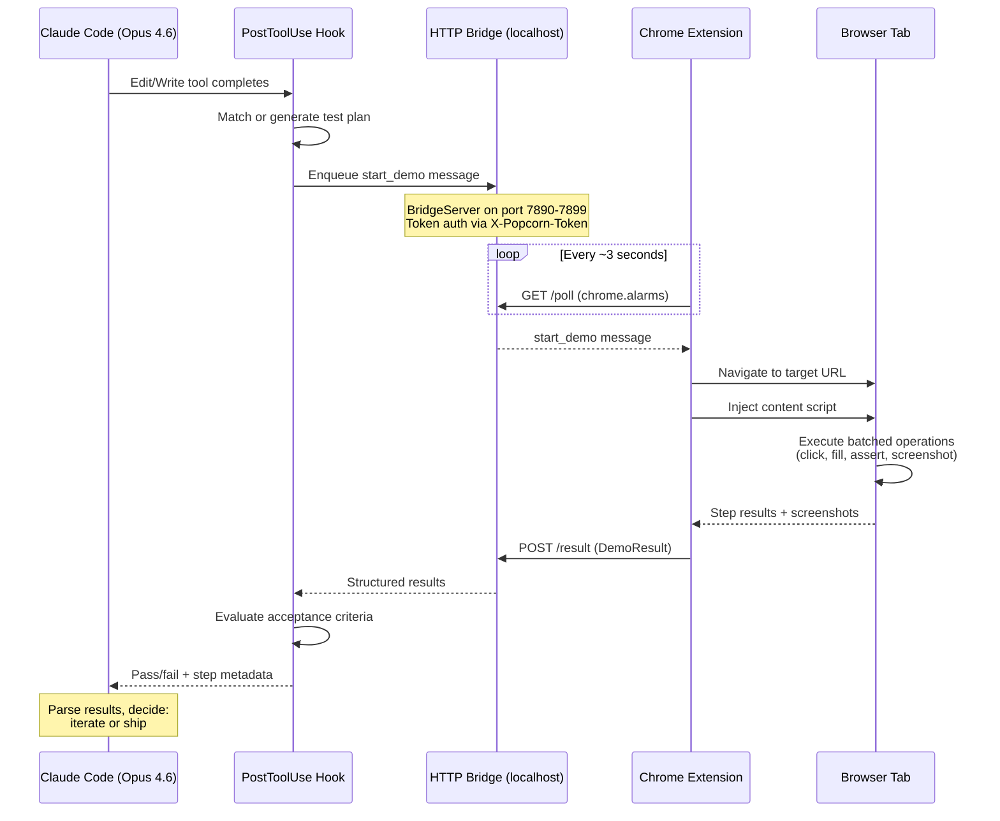
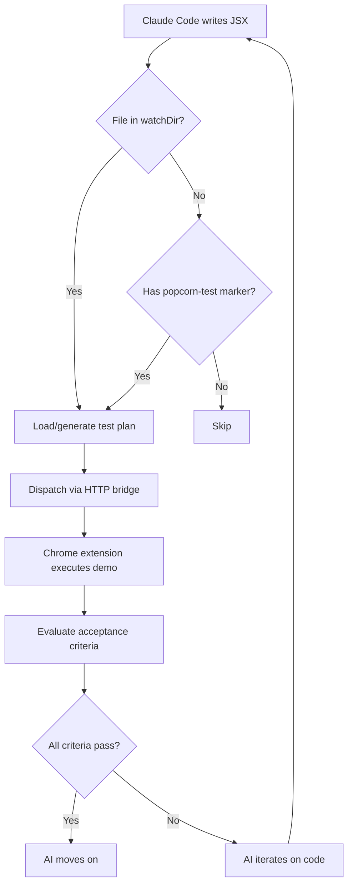

# 🍿 Popcorn

**Autonomous visual testing for AI-generated frontend code.** When Claude Code (Opus 4.6) edits your UI, Popcorn runs a real browser demo, evaluates acceptance criteria, and returns structured results — closing the feedback loop so the AI can self-correct.

> **Problem Statement #1: Build a Tool That Should Exist** — AI writes frontend code blind. Popcorn gives it eyes.

[▶ Demo Video](link-to-video)

---

## Before / After

| | Without Popcorn | With Popcorn |
|---|---|---|
| **AI edits UI code** | Hope it works. Move on. | Automatic visual demo in real Chrome tab. |
| **Testing feedback** | Human opens browser, clicks around, reports back. | Structured results with screenshots in ~3 seconds. |
| **Iteration cycle** | Minutes per round-trip. | Seconds. AI self-corrects autonomously. |

---

## Evidence of Craft

| Metric | Value | Verify |
|--------|-------|--------|
| Tests passing | 387 | `npm test` |
| Test files | 27 | `npx vitest run --reporter=verbose` |
| Packages | 3 (shared, extension, hook) | `npm ls --workspaces` |
| TypeScript mode | Strict (`"strict": true`) | Check any `tsconfig.json` |
| Cloud dependencies | Zero | No API keys, no external URLs |
| External runtime deps | 4 total (react, react-dom, jszip, chokidar) | `package.json` files |
| Build time | <10s | `npm run build` |

```
 Test Files  27 passed (27)
      Tests  387 passed (387)
   Start at  13:41:53
   Duration  32.76s
```

---

## How It Works



---

## Opus 4.6 Integration (real code)

The hook runner is invoked by Claude Code's PostToolUse system:

```typescript
// hook/src/claude-hook-runner.ts (simplified)

// 1. Read hook event from stdin
const event: HookEvent = JSON.parse(input);
const filePath = event.tool_input?.file_path;

// 2. Check if file is in watched directory
const watchDir = path.resolve(projectRoot, config.watchDir);
const isInWatchDir = absFilePath.startsWith(watchDir + path.sep);

// 3. Find or generate test plan
let planName = await findMatchingPlan(baseName, testPlansDir);
if (!planName) {
  const generatedPlan = await generatePlanFromFile(absFilePath, {
    baseUrl: config.baseUrl ?? '/',
    projectRoot,
  });
  const savedPath = await savePlan(generatedPlan, testPlansDir);
  planName = generatedPlan.planName;
}

// 4. Dispatch to Chrome extension via HTTP bridge
const client = new ExtensionClient({ projectRoot });
await client.connect();
const result: DemoResult = await client.startDemo(
  testPlan.planName, testPlan, acceptanceCriteria, filePath,
);

// 5. Evaluate plain-English acceptance criteria
const criteria = parsePlainTextCriteria(acceptanceCriteria.join('\n'));
const evaluation = evaluateAllCriteria(result.steps, criteria);
```

Configured in `.claude/settings.local.json` by `popcorn init`:

```json
{
  "hooks": {
    "PostToolUse": [{
      "matcher": "Edit|Write",
      "hooks": [{
        "type": "command",
        "command": "node /path/to/hook/dist/claude-hook-runner.js",
        "timeout": 30,
        "async": true
      }]
    }]
  }
}
```

---

## Plain-English Acceptance Criteria

Write criteria in plain English. Popcorn pattern-matches them to real evaluators (no LLM involved — pure regex):

| You Write | Popcorn Evaluates |
|-----------|-------------------|
| `"redirects to /dashboard"` | Checks `finalUrl` in step metadata for path match |
| `"within 500ms"` | Sums step durations, asserts total under threshold |
| `shows "Welcome back"` | Searches `actualText` in step metadata for string match |
| `"form submits successfully"` | Verifies all fill/select/click steps passed |
| `"shows error message"` | Scans step metadata for error-related text |
| `"no errors"` | Asserts zero step errors across entire run |

```typescript
// shared/src/acceptance.ts — pattern-matched criteria parsing
const CRITERION_PATTERNS: CriterionPattern[] = [
  // "within 500ms", "under 2 seconds"
  {
    regex: /(?:within|under|in|less than)\s+(\d+(?:\.\d+)?)\s*(ms|milliseconds?|seconds?|sec|s)\b/i,
    build(match, line, i) {
      const ms = unit.startsWith('ms') ? value : value * 1000;
      return { ...completedWithinDuration(ms), id: `custom-${i}`, description: line };
    },
  },
  // "redirects to /dashboard"
  {
    regex: /(?:redirects?\s+to|navigates?\s+to|url\s+(?:contains?|includes?))\s+(\S+)/i,
    build(match, line, i) {
      return {
        evaluate(stepResults) {
          // Scans step metadata for matching URL
          const finalUrl = stepResults[j].metadata?.finalUrl;
          if (finalUrl?.includes(expectedPath))
            return { passed: true, message: `Redirected to ${finalUrl}` };
        },
      };
    },
  },
  // ... 5 more patterns: error display, form submission, no errors,
  //     all steps pass, text content visible
];
```

---

## Architecture

```
+------------------+          HTTP (localhost)         +-------------------+
|                  |  GET /poll ───────────────────>   |                   |
|  Hook (Node.js)  |                                   | Chrome Extension  |
|                  |  <─────────────── POST /result    |  (Manifest V3)    |
|  - Watcher       |                                   |                   |
|  - PlanGenerator |  Token: X-Popcorn-Token           |  - Bridge Client  |
|  - PlanLoader    |  Ports: 7890-7899                 |  - Background SW  |
|  - BridgeServer  |  Fallback: .popcorn/outbox/       |  - Content Script |
|  - ExtClient     |                                   |  - Offscreen Rec  |
|  - CriteriaEval  |                                   |  - Tape Store     |
|                  |                                   |  - Popup (React)  |
+------------------+                                   +-------------------+
        |                                                       |
        v                                                       v
  Claude Code (Opus 4.6)                               Real Browser Tab
  PostToolUse hook fires                              14 action types executed
  on Edit/Write                                       at 5+ actions/sec
```

---

## Quick Start

```bash
# One-time setup (Popcorn repo)
git clone https://github.com/timothynice/popcorn.git && cd popcorn
npm install && npm run build && npm link

# Per-project setup
cd ~/my-project
popcorn init

# Load Chrome extension
# Chrome > Extensions > Load unpacked > select popcorn/extension/dist/

# That's it. Edit frontend code with Claude Code and Popcorn runs automatically.
```

See [SETUP.md](SETUP.md) for detailed instructions and troubleshooting.

---

## The Autonomous Loop



---

## Hackathon Scoring Criteria

| Criterion | Evidence |
|-----------|----------|
| **Impact (25%)** | Every developer using AI coding tools faces the verification problem. Popcorn eliminates manual testing of AI-generated UI changes. Benefits solo devs, AI-first teams, QA engineers, and PMs. |
| **Opus 4.6 Use (25%)** | PostToolUse hook reads from stdin, dispatches to Chrome, evaluates criteria, prints structured summary. Purpose-built for Claude Code's tool-use lifecycle. Not a chatbot wrapper — deep autonomous automation. |
| **Depth & Execution (20%)** | 3-package monorepo, HTTP bridge with token auth, Chrome MV3 with alarms-based polling, Offscreen API video recording, pattern-matched criteria evaluators, import graph analysis, 387 tests. |
| **Demo (30%)** | Watch AI edit a login form → Popcorn auto-tests in 2 seconds → finds a bug → AI fixes it → Popcorn confirms. Zero human intervention. |

---

## Tech Stack

TypeScript (strict) · React 18 · Vite · Chrome MV3 · Vitest · Node.js HTTP · chokidar · MediaRecorder API · Offscreen API · IndexedDB · CSS Modules

---

*Built with Claude Code (Opus 4.6) and a lot of popcorn. 🍿*
