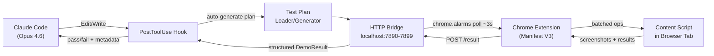
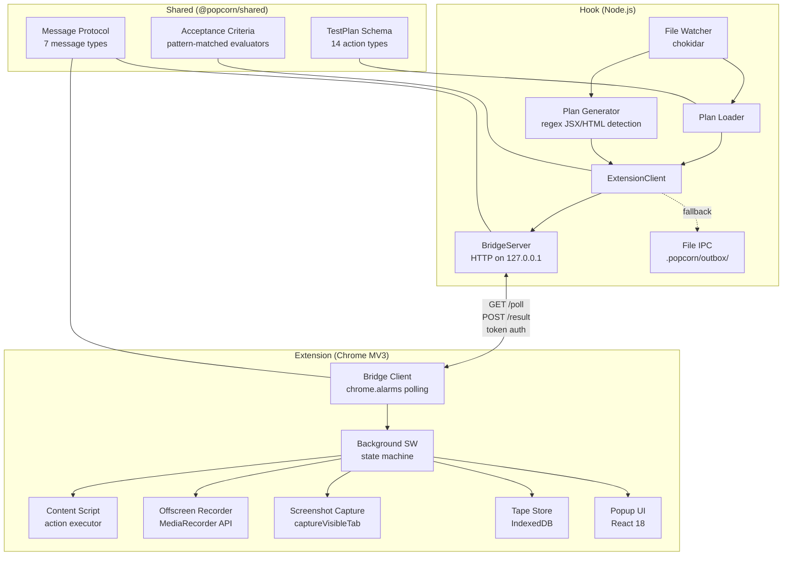
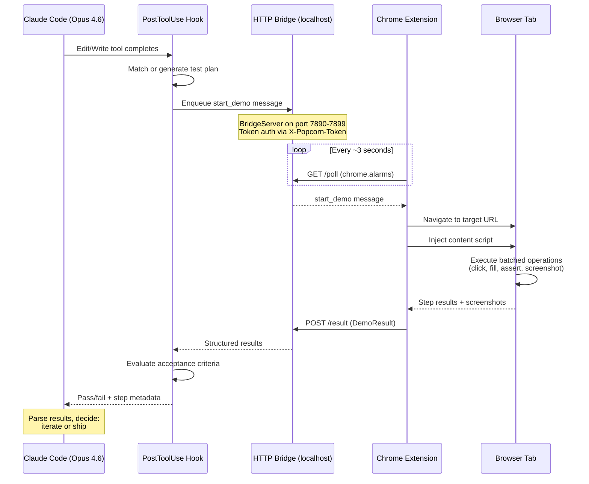
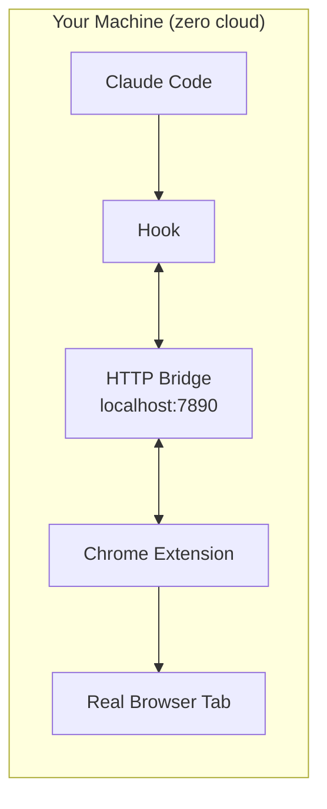
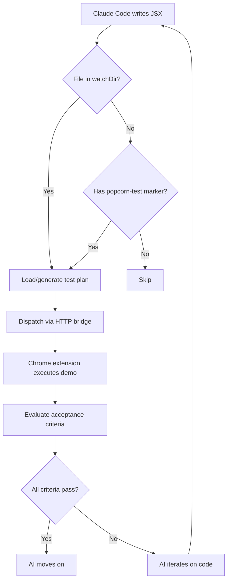

# Hackathon README Versions for Popcorn

Three standalone README variants optimized for different hackathon judge personas.

---

# VERSION A: "Architecture Showcase"

---

<!-- Copy below this line for Version A -->


# Popcorn

**Autonomous visual testing for AI-generated frontend code.**

When Claude Code (Opus 4.6) edits your UI, Popcorn automatically runs a visual demo in Chrome, evaluates plain-English acceptance criteria, and returns structured results -- so the AI can iterate without human intervention.

[Demo Video](link-to-video)

---

## How It Works

1. **Claude Code edits a file** -- the PostToolUse hook fires automatically on any `Edit` or `Write` operation
2. **Popcorn detects the change** -- matches it to a test plan or auto-generates one via regex-based JSX/HTML pattern detection
3. **Test plan dispatched over HTTP** -- the hook's BridgeServer enqueues the plan; the Chrome extension polls and receives it within ~3 seconds
4. **Chrome executes the demo** -- batched browser operations (click, fill, navigate, assert, screenshot) run at 5+ actions/sec in a real browser
5. **Acceptance criteria evaluated** -- plain-English criteria like `"redirects to /dashboard"` and `"within 500ms"` are pattern-matched to real evaluator functions
6. **Structured results returned to AI** -- step metadata (actual URLs, text content, assertion values) flows back through the HTTP bridge for Claude Code to parse and decide: iterate or ship



---

## Architecture

Three npm workspace packages, zero cloud dependencies, everything on localhost.



---

## Opus 4.6 Integration

Popcorn hooks into Claude Code via the **PostToolUse** hook system. When Opus 4.6 uses the `Edit` or `Write` tools to modify frontend code, the hook runner activates:

```json
// .claude/settings.local.json (generated by popcorn init)
{
  "hooks": {
    "PostToolUse": [{
      "matcher": "Edit|Write",
      "hooks": [{
        "type": "command",
        "command": "node /path/to/hook/dist/claude-hook-runner.js",
        "timeout": 30,
        "async": true
      }]
    }]
  }
}
```

The hook runner reads the event from stdin, resolves the changed file against the configured watch directory, loads or generates a test plan, dispatches it to the Chrome extension, and returns a structured summary that Opus 4.6 can parse to decide whether to iterate.

---

## Technical Highlights

- **HTTP bridge with token auth** -- `crypto.randomBytes(16)` token on server start, validated via `X-Popcorn-Token` header. Extension probes ports 7890-7899 for discovery, caches with 60s TTL.
- **Auto-generated test plans** -- regex-based detection of forms, inputs, buttons, and links in JSX/HTML. No LLM call needed for plan creation.
- **Plain-English acceptance criteria** -- priority-ordered pattern matching: `"within 500ms"` maps to duration evaluator, `"redirects to /dashboard"` maps to URL checker, `shows "Success"` maps to text content evaluator.
- **Route-aware visual testing** -- import graph analysis detects keyboard navigation, indexed-click patterns, and sequential navigation. Generates step sequences with 400ms animation guards.
- **Dual transport** -- HTTP-first with automatic file-based IPC fallback (`.popcorn/outbox/`). `getTransport()` reports which is active.
- **Service worker keep-alive** -- `chrome.alarms` at 0.05 min (~3s) keeps the background SW alive and polling.
- **Offscreen video recording** -- Chrome Offscreen API + `tabCapture` + MediaRecorder (VP9/VP8). Re-run with video via popup button (user gesture enables tabCapture).

---

## Quick Start

```bash
# One-time setup (Popcorn repo)
git clone <repo-url> && cd popcorn
npm install && npm run build && npm link

# Per-project setup
cd ~/my-project
popcorn init    # Scaffolds test-plans/, config, Claude Code hook

# That's it. Edit frontend code with Claude Code and watch Popcorn run.
```

`popcorn init` auto-detects your frontend source directory, scans existing files for interactive elements, and generates test plans automatically.

---

## Metrics

| Metric | Value |
|--------|-------|
| Tests passing | 387 |
| Test files | 27 |
| Packages | 3 (shared, extension, hook) |
| Lines of TypeScript | ~20,000 |
| TypeScript mode | Strict |
| Module system | ES modules only |
| Cloud dependencies | Zero |
| External API calls | None |
| Chrome manifest | V3 |
| Action types | 14 (click, fill, navigate, assert, screenshot, ...) |

---

## Why Popcorn Fits the Hackathon Criteria

| Criterion | How Popcorn Delivers |
|-----------|---------------------|
| **Technical Complexity** | Three-package monorepo with HTTP bridge, Chrome MV3 extension, PostToolUse hook integration, real-time bidirectional communication, and pattern-matched acceptance criteria -- all built from scratch with zero cloud. |
| **Innovation** | First tool to close the AI coding loop with autonomous visual verification. AI edits code, Popcorn tests it in a real browser, and results flow back so the AI can self-correct. |
| **Completeness** | 387 tests, 27 test files, full CLI scaffolding (`popcorn init`), auto-generated test plans, video recording, screenshot capture, IndexedDB storage, React popup dashboard. |
| **Opus 4.6 Integration** | Native PostToolUse hook -- Popcorn is purpose-built for Claude Code's tool-use lifecycle, reading hook events from stdin and returning structured results the model can parse. |

---

## Tech Stack

TypeScript (strict) / Vitest / React 18 / Vite / Chrome MV3 / Node.js HTTP / chokidar / MediaRecorder API / Offscreen API / IndexedDB / CSS Modules

---

<!-- End Version A -->

---
---
---

# VERSION B: "Visual Narrative"

---

<!-- Copy below this line for Version B -->

# Popcorn

### AI edits code. Popcorn tests it. Automatically.

[Demo Video](link-to-video)

---

## The Problem

AI coding assistants generate frontend code blind. They write JSX, push pixels, and hope for the best. There is no feedback loop -- the AI never sees what it built.

## The Solution

Popcorn closes the loop. Every time Claude Code (Opus 4.6) edits a frontend file, Popcorn automatically:

```
AI writes code  -->  Popcorn detects change  -->  Chrome runs visual demo  -->  Results return to AI
```

No manual testing. No switching windows. No "does this look right?" The AI verifies its own work.

---

## Before / After

| | Without Popcorn | With Popcorn |
|---|---|---|
| **AI edits UI code** | Hope it works. Move on. | Automatic visual demo in real Chrome tab. |
| **Testing feedback** | Human opens browser, clicks around, reports back. | Structured results with screenshots in ~3 seconds. |
| **Iteration cycle** | Minutes per round-trip. | Seconds. AI self-corrects autonomously. |

---

## Full Data Flow



---

## One-Command Setup

```bash
cd ~/my-project
popcorn init
```

That's it. This command:
- Detects your frontend source directory
- Scans files for interactive elements (forms, buttons, inputs)
- Generates test plans automatically
- Configures the Claude Code PostToolUse hook
- Creates `popcorn.config.json` with your project settings

---

## What Popcorn Captures

| Capture | Description |
|---------|-------------|
| **Screenshots** | Automatic `captureVisibleTab` at any step. Stored in DemoResult. |
| **Video** | VP9/VP8 via Offscreen API + tabCapture. Available via "Re-run with Recording" button. |
| **Step Metadata** | Actual URLs, text content, assertion values -- structured data, not just pass/fail. |
| **Acceptance Results** | Plain-English criteria evaluated against real browser state. |

Screenshot placeholders:
- `[Popup Dashboard showing test results and hook connection status]`
- `[Test plan auto-generated from a login form component]`
- `[Acceptance criteria evaluation: "redirects to /dashboard" -- PASSED]`

---

## Architecture at a Glance



**3 packages** / **387 tests** / **~20K lines TypeScript strict** / **ES modules only**

---

## Plain-English Acceptance Criteria

Write criteria in plain English. Popcorn pattern-matches them to real evaluators:

| You Write | Popcorn Evaluates |
|-----------|-------------------|
| `"redirects to /dashboard"` | Checks `finalUrl` in step metadata for path match |
| `"within 500ms"` | Sums step durations, asserts total under threshold |
| `shows "Welcome back"` | Searches `actualText` in step metadata for string match |
| `"form submits successfully"` | Verifies all fill/select/click steps passed without errors |
| `"no errors"` | Asserts zero step errors across entire run |

---

## Hackathon Criteria Alignment

- **Technical Complexity**: HTTP bridge, Chrome MV3, PostToolUse hooks, pattern-matched evaluators, route-aware testing
- **Innovation**: First autonomous visual testing loop for AI-generated code
- **Completeness**: 387 tests, CLI scaffolding, auto-generated plans, video recording
- **Opus 4.6 Integration**: Purpose-built for Claude Code's PostToolUse lifecycle

---

## Tech Stack

TypeScript strict / React 18 / Vite / Chrome MV3 / Vitest / Node.js HTTP / chokidar / MediaRecorder / Offscreen API / IndexedDB

---

<!-- End Version B -->

---
---
---

# VERSION C: "Proof of Execution"

---

<!-- Copy below this line for Version C -->


# Popcorn

**Autonomous visual testing for AI-generated frontend code.** When Claude Code (Opus 4.6) edits your UI, Popcorn runs a real browser demo, evaluates acceptance criteria, and returns structured results -- closing the feedback loop so the AI can self-correct.

[Demo Video](link-to-video)

---

## Evidence of Craft

| Metric | Value | Verify |
|--------|-------|--------|
| Tests passing | 387 | `npm test` |
| Test files | 27 | `npx vitest run --reporter=verbose` |
| Packages | 3 (shared, extension, hook) | `npm ls --workspaces` |
| Lines of TypeScript | ~20,000 | `find shared extension hook -name '*.ts' -o -name '*.tsx' \| xargs wc -l` |
| TypeScript mode | Strict (`"strict": true`) | Check any `tsconfig.json` |
| Cloud dependencies | Zero | Grep the source -- no API keys, no external URLs |
| External runtime deps | 4 total (react, react-dom, jszip, chokidar) | `package.json` files |
| Build time | <10s | `npm run build` |

---

## Test Output (actual)

```
 Test Files  27 passed (27)
      Tests  387 passed (387)
   Start at  13:41:53
   Duration  32.76s (transform 595ms, setup 229ms, collect 1.21s, tests 46.73s, environment 4.08s, prepare 1.43s)
```

---

## How the Opus 4.6 Hook Works (real code)

The hook runner is invoked by Claude Code's PostToolUse system. Here is the actual entry point:

```typescript
// hook/src/claude-hook-runner.ts (simplified)

// 1. Read hook event from stdin
const event: HookEvent = JSON.parse(input);
const filePath = event.tool_input?.file_path;

// 2. Check if file is in watched directory
const watchDir = path.resolve(projectRoot, config.watchDir);
const isInWatchDir = absFilePath.startsWith(watchDir + path.sep);

// 3. Find or generate test plan
let planName = await findMatchingPlan(baseName, testPlansDir);
if (!planName) {
  const generatedPlan = await generatePlanFromFile(absFilePath, {
    baseUrl: config.baseUrl ?? '/',
    projectRoot,
  });
  const savedPath = await savePlan(generatedPlan, testPlansDir);
  planName = generatedPlan.planName;
}

// 4. Dispatch to Chrome extension via HTTP bridge
const client = new ExtensionClient({ projectRoot });
await client.connect();
const result: DemoResult = await client.startDemo(
  testPlan.planName, testPlan, acceptanceCriteria, filePath,
);

// 5. Evaluate plain-English acceptance criteria
const criteria = parsePlainTextCriteria(acceptanceCriteria.join('\n'));
const evaluation = evaluateAllCriteria(result.steps, criteria);
```

Configured in `.claude/settings.local.json` by `popcorn init`:

```json
{
  "hooks": {
    "PostToolUse": [{
      "matcher": "Edit|Write",
      "hooks": [{
        "type": "command",
        "command": "node /absolute/path/to/hook/dist/claude-hook-runner.js",
        "timeout": 30,
        "async": true
      }]
    }]
  }
}
```

---

## Acceptance Criteria Parsing (real code)

Plain-English criteria are pattern-matched to evaluator functions. No LLM involved -- pure regex:

```typescript
// shared/src/acceptance.ts
const CRITERION_PATTERNS: CriterionPattern[] = [
  // "within 500ms", "under 2 seconds"
  {
    regex: /(?:within|under|in|less than)\s+(\d+(?:\.\d+)?)\s*(ms|milliseconds?|seconds?|sec|s)\b/i,
    build(match, line, i) {
      const value = parseFloat(match[1]);
      const unit = match[2].toLowerCase();
      const ms = unit.startsWith('ms') ? value : value * 1000;
      return { ...completedWithinDuration(ms), id: `custom-${i}`, description: line };
    },
  },
  // "redirects to /dashboard"
  {
    regex: /(?:redirects?\s+to|navigates?\s+to|url\s+(?:contains?|includes?))\s+(\S+)/i,
    build(match, line, i) {
      const expectedPath = match[1];
      return {
        id: `custom-${i}`, description: line, type: 'functional',
        evaluate(stepResults) {
          for (let j = stepResults.length - 1; j >= 0; j--) {
            const finalUrl = stepResults[j].metadata?.finalUrl;
            if (finalUrl?.includes(expectedPath))
              return { criterionId: `custom-${i}`, passed: true,
                       message: `Redirected to ${finalUrl}` };
          }
          return { criterionId: `custom-${i}`, passed: false,
                   message: `Expected redirect to "${expectedPath}" not found` };
        },
      };
    },
  },
  // ... 5 more patterns: error display, form submission, no errors,
  //     all steps pass, text content visible
];
```

---

## HTTP Bridge (real code)

Zero external dependencies. Built on Node.js `http` module:

```typescript
// hook/src/bridge-server.ts
export class BridgeServer {
  private server: http.Server | null = null;
  private token: string;
  private queue: PopcornMessage[] = [];

  constructor() {
    this.token = crypto.randomBytes(16).toString('hex');
  }

  // Routes:
  //   GET  /health  -- discovery (no auth), returns { port, token }
  //   GET  /poll    -- drain message queue (token required)
  //   POST /result  -- receive results from extension (token required)
}
```

Extension discovery probes ports 7890-7899:

```typescript
// extension/src/background/bridge-client.ts
export async function discoverHookPort(): Promise<BridgeCache | null> {
  for (const port of [7890, 7891, ..., 7899]) {
    const resp = await fetch(`http://127.0.0.1:${port}/health`, {
      signal: AbortSignal.timeout(1000),
    });
    if (resp.ok) {
      const data = await resp.json();
      if (data.ok && data.token) return { port, token: data.token, discoveredAt: Date.now() };
    }
  }
  return null;
}
```

---

## Architecture

```
+------------------+          HTTP (localhost)         +-------------------+
|                  |  GET /poll ───────────────────>   |                   |
|  Hook (Node.js)  |                                   | Chrome Extension  |
|                  |  <─────────────── POST /result    |  (Manifest V3)    |
|  - Watcher       |                                   |                   |
|  - PlanGenerator |  Token: X-Popcorn-Token           |  - Bridge Client  |
|  - PlanLoader    |  Ports: 7890-7899                 |  - Background SW  |
|  - BridgeServer  |  Fallback: .popcorn/outbox/       |  - Content Script |
|  - ExtClient     |                                   |  - Offscreen Rec  |
|  - CriteriaEval  |                                   |  - Tape Store     |
|                  |                                   |  - Popup (React)  |
+------------------+                                   +-------------------+
        |                                                       |
        v                                                       v
  Claude Code (Opus 4.6)                               Real Browser Tab
  PostToolUse hook fires                              14 action types executed
  on Edit/Write                                       at 5+ actions/sec
```

---

## Complete Setup + Verification

```bash
# 1. Clone and build
git clone <repo-url> && cd popcorn
npm install && npm run build

# 2. Verify tests pass
npm test
# Expected: Test Files 27 passed (27), Tests 387 passed (387)

# 3. Link globally
npm link

# 4. Set up a target project
cd ~/my-project
popcorn init

# 5. Verify scaffolding
ls test-plans/          # Should contain auto-generated .json plans
cat popcorn.config.json # Should show watchDir and baseUrl
cat .claude/settings.local.json  # Should show PostToolUse hook config

# 6. Load the extension
# Chrome > Extensions > Load unpacked > select popcorn/extension/dist/

# 7. Use Claude Code on your project
# Every Edit/Write to frontend files triggers Popcorn automatically
```

---

## Message Protocol (typed, validated)

Seven message types, all type-safe:

```typescript
// shared/src/messages.ts
export type PopcornMessage =
  | StartDemoMessage      // Hook -> Extension: run this test plan
  | DemoResultMessage     // Extension -> Hook: here are the results
  | HookReadyMessage      // Hook announces itself
  | ExtensionReadyMessage // Extension announces itself
  | HookErrorMessage      // Hook error
  | SaveCriteriaMessage   // Save acceptance criteria
  | SaveCriteriaResultMessage; // Criteria save confirmation

export function isPopcornMessage(value: unknown): value is PopcornMessage {
  // Runtime type guard -- validates structure at protocol boundary
}
```

---

## Hackathon Scoring Criteria

| Criterion | Evidence |
|-----------|----------|
| **Technical Complexity** | 3-package monorepo, HTTP bridge with token auth, Chrome MV3 service worker with alarms-based polling, Offscreen API video recording, pattern-matched criteria evaluators, import graph analysis for route detection. 20K lines of strict TypeScript. |
| **Innovation** | No existing tool autonomously verifies AI-generated frontend code in a real browser and feeds structured results back to the AI. Popcorn is the first closed-loop visual testing system for AI coding agents. |
| **Completeness** | 387 tests across 27 files. CLI scaffolding. Auto-generated test plans. Video recording. Screenshot capture. IndexedDB storage. React popup dashboard. Dual-transport IPC. Run `npm test` to verify. |
| **Opus 4.6 Integration** | PostToolUse hook reads from stdin, dispatches to Chrome, evaluates criteria, prints structured summary. Purpose-built for Claude Code's tool-use lifecycle. Zero manual intervention required. |

---



---

<!-- End Version C -->

---
---
---

# Recommendation

## Which Version to Use

**For the Anthropic Build with Claude contest: Version C ("Proof of Execution").**

Here is the reasoning:

1. **Judges will be skeptical.** Hackathon projects are notorious for looking impressive in a README but not actually working. Version C leads with verifiable evidence: a test output block judges can reproduce with `npm test`, a metrics table with verification commands, and real code snippets from the actual implementation -- not pseudocode.

2. **Code speaks louder than diagrams.** The acceptance criteria parsing code and the hook runner code demonstrate genuine engineering depth in a way that diagrams cannot. A judge who reads the `CRITERION_PATTERNS` array immediately understands the system is real, not vaporware.

3. **The "Proof" framing is differentiated.** Most hackathon READMEs lean toward Version A (architecture) or Version B (visuals). Leading with evidence is unusual and memorable.

4. **It still includes architecture.** The ASCII diagram and Mermaid flow chart give sufficient architectural context without drowning in boxes and arrows.

**However, consider a hybrid approach:**

- Take Version C as the base
- Add Version B's sequence diagram (the `sequenceDiagram` Mermaid block) -- it is the single most effective visual for explaining the data flow to someone scanning quickly
- Add Version A's badge row at the top of Version C (already present)
- Keep Version B's "Before/After" table -- it communicates the value proposition in 3 seconds

This hybrid keeps the "prove it works" framing while adding the two highest-impact visual elements from the other versions.

**Final note on the video placeholder:** All three versions include `[Demo Video](link-to-video)`. A 60-second screen recording of Popcorn running end-to-end (Claude Code edits a file, Popcorn popup shows results appearing, terminal shows the structured summary) would be the single highest-impact addition to any version. Record it before submission.
