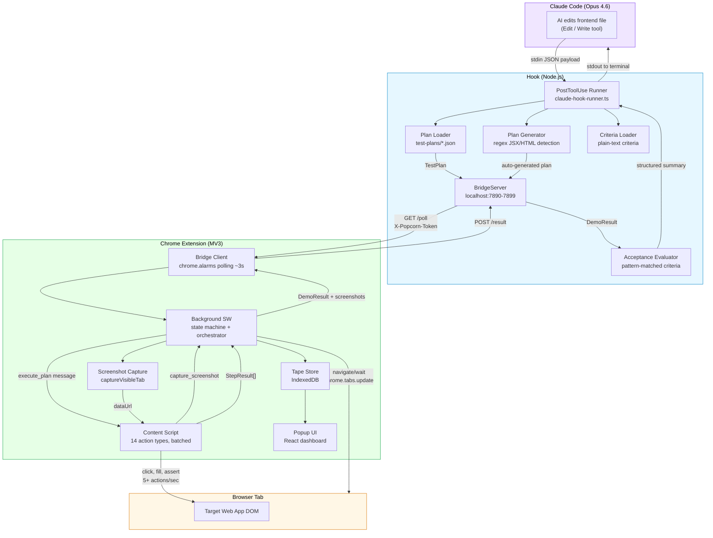
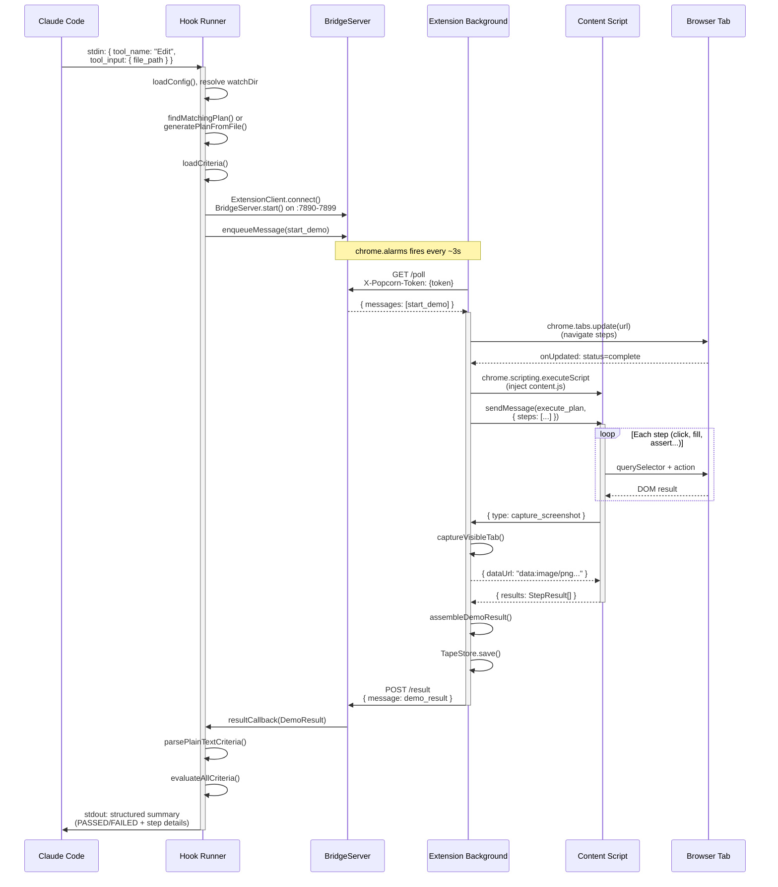
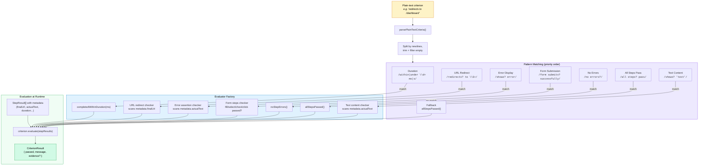
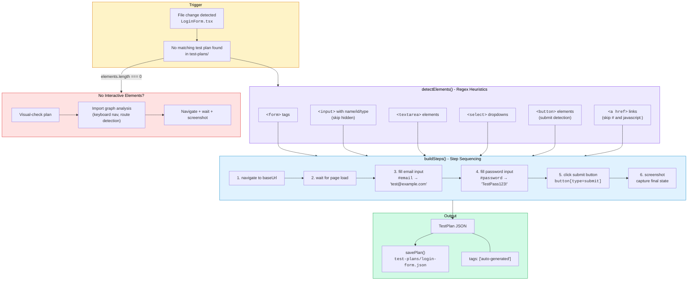

# Popcorn Hackathon Visual Assets

All diagrams use Mermaid syntax. Render via [mermaid.live](https://mermaid.live), GitHub markdown preview, or any Mermaid-compatible tool.

---

## 1. Architecture Overview Diagram



---

## 2. Data Flow Sequence Diagram



---

## 3. Acceptance Criteria Flow



---

## 4. Auto-Generation Pipeline



---

## 5. GitHub Badges

Copy-paste these into your README or submission page:

```markdown


```

**Rendered preview:**


---

## 6. Screenshot Capture List

These are the key screenshots to capture for the hackathon submission. Each entry includes what to show and how to set it up.

### 6.1 Extension Popup - Tape List

**What:** The popup showing a list of completed demo tapes with pass/fail status badges and thumbnails.

**Setup:**
1. Run several demos (both passing and failing) so the tape list has variety
2. Click the Popcorn extension icon to open the popup
3. The main view shows tape cards with green checkmarks or red X badges
4. Make sure the StatusBar at the bottom shows the green dot (hook connected)

**Key elements to highlight:** Pass/fail badges, tape names, duration, hook connection indicator

### 6.2 Extension Popup - Tape Detail with Screenshots

**What:** A single tape expanded to show the step-by-step results with captured screenshots inline.

**Setup:**
1. Click on a tape card that has screenshots (any demo with screenshot steps)
2. The detail view shows each step with [OK]/[FAIL] indicators
3. Screenshots appear inline next to their corresponding steps
4. If the tape has a test plan stored, the "Re-run with Video Recording" button is visible

**Key elements to highlight:** Step results with metadata, inline screenshots, re-run button

### 6.3 Terminal - Popcorn Hook Output

**What:** The structured summary printed by the hook after a demo completes.

**Setup:**
1. Have Claude Code edit a frontend file in a project with Popcorn configured
2. The hook fires automatically and prints to the Claude Code terminal
3. Capture the output showing:
   - `[Popcorn] File changed: src/components/LoginForm.tsx`
   - `[Popcorn] Dispatching test plan 'login-form'`
   - `--- Popcorn Demo Result ---`
   - Step-by-step [OK]/[FAIL] results with durations
   - Criteria evaluation results
   - `---------------------------`

**Key elements to highlight:** The structured format that Claude reads to decide next steps

### 6.4 Terminal - `popcorn init` Output

**What:** The CLI scaffolding a new project in one command.

**Setup:**
1. Create or use a sample project with some React/Vue/HTML files
2. Run `popcorn init` from the project root
3. Capture the output showing:
   - Watch directory auto-detection
   - Source file scanning results
   - Generated test plans for detected interactive elements
   - Created files: `popcorn.config.json`, `test-plans/`, `.claude/settings.local.json`
   - Hook runner path resolution

**Key elements to highlight:** Zero-config setup, auto-detection, instant plan generation

### 6.5 Claude Code Session - Full Loop in Action

**What:** A Claude Code conversation where the AI edits a file, Popcorn runs automatically, and the AI reads the results.

**Setup:**
1. Start a Claude Code session in a Popcorn-configured project
2. Ask Claude to modify a UI component (e.g., "add email validation to the login form")
3. After the Edit tool completes, the PostToolUse hook fires
4. Capture the sequence:
   - Claude's edit appearing in the conversation
   - The `[Popcorn]` output appearing in the terminal
   - Claude reading the results and either iterating or confirming success

**Key elements to highlight:** The autonomous feedback loop - edit, test, read results, iterate

### 6.6 Architecture Comparison (Optional)

**What:** A before/after showing the traditional manual testing workflow vs. the Popcorn automated loop.

**Before:** Developer edits code -> switches to browser -> manually refreshes -> visually inspects -> switches back to editor -> reports to AI

**After:** AI edits code -> Popcorn automatically demos in browser -> AI reads structured results -> AI iterates or moves on

This can be a simple two-panel diagram or screenshot composite.
